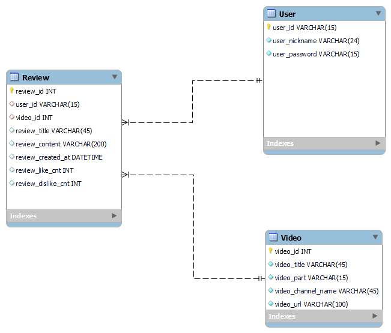
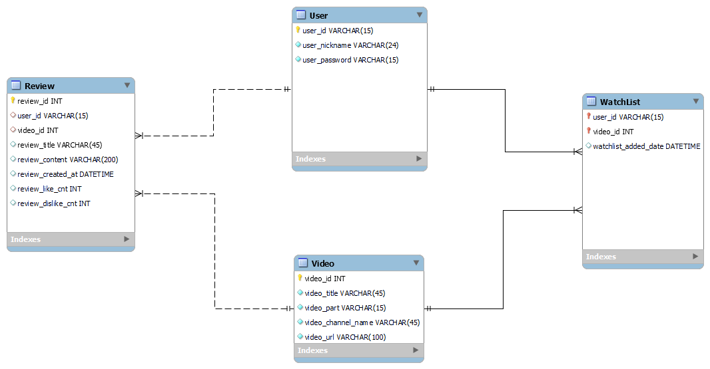

#  PTJ5-F

  

> 팀장 : 최혁규

> 팀원 : 김서현, 배장한

  

##  요구사항

Ssafit Database 구현

  

###  기본 기능

- Database ERD작성

- DDL작성 후 DB 생성
  

##  구현 방식

- Mysql EER Diagram 사용하여 구조를 작성한 후 DDL생성

## ERD
#### 1. 초기 작성 버전


#### 2. 나중에 볼 동영상 리스트 추가 버전


#### 3. 개선사항 반영 버전


##  생성형 AI를 통한 개선사항 도출

  
> 프롬포트
```
너는 SQL에 능통하고, DB ERD 구조화의 전문가야.
내가 DDL을 주면, 개선사항을 말해줄래?
```

> 개선 사항 적용한 답변만 기술
``` 
- 데이터 형식 및 제약 조건 개선: 
    -   `User` 테이블의 `user_password` 필드는 길이가 15자로 설정되어 있는데, 이는 보안상의 이유로 충분하지 않을 수 있습니다. 일반적으로 해시된 비밀번호를 저장할 때는 최소 60자 길이를 권장합니다.
    -   `User` 테이블의 `user_id` 필드에 대한 인덱스 생성 방식을 VISIBLE에서 기본값인 INVISIBLE로 변경하는 것이 좋을 수 있습니다. 일반적으로 PRIMARY KEY는 자동으로 인덱스가 생성되기 때문에, UNIQUE INDEX를 VISIBLE로 설정할 필요는 없습니다.
  
-   외래 키 ON DELETE 및 ON UPDATE 정책:
    -   `Review` 테이블의 외래 키 정책으로 `NO ACTION`을 사용하고 있습니다. 실제 사용 시나리오를 고려하여 `ON DELETE CASCADE` (참조하는 엔터티가 삭제될 때 관련 데이터도 같이 삭제) 또는 `ON UPDATE CASCADE` (참조하는 엔터티의 ID가 변경될 때 같이 업데이트) 같은 옵션을 사용하는 것이 적합할 수 있습니다.
    - 
-   문자 집합 및 정렬 규칙 명시:
    -   데이터베이스 및 테이블 생성 시 `utf8mb4`와 같은 보다 최신의 문자 집합을 사용하고, 정렬 규칙을 `utf8mb4_general_ci` 등으로 설정하여 이모티콘 등의 특수 문자도 문제없이 처리할 수 있도록 하는 것이 좋습니다.
```
  
  
  
  

##  개선 과정

1.  user_id 와 video_id를 참조하는 review 테이블의 경우 사용자가 탈퇴하거나, 비디오가 삭제되면 해당 리뷰는 삭제되어야 한다. 그러나 우리가 처음 작성한 DDL에는 no action으로 설정했기 때문에, 그대로 남아있었을 것이다. 생성형 AI를 통해 참조 엔티티가 삭제, 수정되었을 때 해당 Review도 같이 삭제, 수정되도록 설정했다.

> Before  Review TABLE DDL 
```
CONSTRAINT `user_id` 
	FOREIGN KEY (`user_id`) REFERENCES `pjt5_f_db`.`User` (`user_id`) 
	ON DELETE NO ACTION 
	ON UPDATE NO ACTION, 
CONSTRAINT `video_id` 
	FOREIGN KEY (`video_id`) REFERENCES `pjt5_f_db`.`Video` (`video_id`) 
	ON DELETE NO ACTION 
	ON UPDATE NO ACTION)
```

> After Review TABLE DDL
```
  CONSTRAINT `fk_review_user`
    FOREIGN KEY (`user_id`)
    REFERENCES `pjt5_f_db`.`User` (`user_id`)
    ON DELETE CASCADE
    ON UPDATE CASCADE,
  CONSTRAINT `fk_review_video`
    FOREIGN KEY (`video_id`)
    REFERENCES `pjt5_f_db`.`Video` (`video_id`)
    ON DELETE CASCADE
    ON UPDATE CASCADE)
```

2.  user_password 필드를 varchar(15) 에서 varchar(60)으로 수정.
>  -   `User` 테이블의 `user_password` 필드는 길이가 15자로 설정되어 있는데, 이는 보안상의 이유로 충분하지 않을 수 있습니다. 일반적으로 해시된 비밀번호를 저장할 때는 최소 60자 길이를 권장합니다.

3. 이모지를 표현할 수 있도록 콜레이션 설정. 단 테이블 전체 설정이 아닌 title, content 단일 컬럼에만 설정함.
> -   문자 집합 및 정렬 규칙 명시:
    -   데이터베이스 및 테이블 생성 시 `utf8mb4`와 같은 보다 최신의 문자 집합을 사용하고, 정렬 규칙을 `utf8mb4_general_ci` 등으로 설정하여 이모티콘 등의 특수 문자도 문제없이 처리할 수 있도록 하는 것이 좋습니다.
- 콜레이션 설정을 데이터베이스 단위로 설정하려 했으나, 그럴 경우 title, content 외에 user_id, user_name, user_password 등 다른 컬럼에도 이모지가 설정될 수 있어서 title, content 단일 컬럼에만 설정했다.

## 후기

### 최혁규

- 이번 프로젝트 회차에서 DB를 설계를 하고, 지난 회차에서 JAVA 코드를 작성했다. 어떻게 보면 순서가 반대로 되었다. 사실 DB 설계 단계에서, 컬럼 네이밍룰을 통일하고, 해당 컬럼 명을 토대로 User, Review, Video 클래스의 속성들을 네이밍 해야했다. 하지만 커리큘럼 순서 상 어쩔 수 없이 반대로 진행하였는데, 이 과정 속에서 추가, 심화 과정을 하기 위해선 dto 패키지의 User, Review, Video 클래스의 속성 네이밍을 데이터 컬럼 명과 동일하게 해야 혼동이 오지 않을 것 같다.

- 그런데 다시 생각해보니 어차피 각 클래스의 속성들은 {클래스명}.{속성} 으로 표현하므로 상관없을 것 같기도 하다. 하핫

- 이번 프로젝트의 주된 요구사항은 직접 ERD를 작성하고, 토대로 DDL을 작성하여 생성형 AI를 활용하여 개선하는 것이었다. ERD 작성과 DDL은 Mysql 내에서 한번에 진행할 수 있어서 편했다. 다른 조들의 말을 들어보면 ERD CLOUD 라는 사이트에서도 동일하게 ERD 작성과 DDL 생성까지 가능한 것 같았다. 생성한 DDL을 생성형 AI(GPT4o)에게 입력하여 개선 사항을 받아보았다.
 
## 개선사항
- 우선 User 테이블의 user_password 를 varchar(15)로 설정했는데 비밀번호의 **해시값** 을 저장하기에는 부적절하여 해시값을 모두 저장할 수 있도록 충분한 길이인 varchar(60)으로 변경했다.

- 리뷰 작성 시간을 나타내는 Review_created_at 컬럼의 default 값을 now() 로 설정하였지만, DDL 내에서 DEFAULT 절에서 사용되는 값으로는 함수를 지원하지 않아, 키워드인 CURRENT_TIMESTAMP로 설정했다. 

- **문자 집합 정의와 범위 설정의 중요성** 
	- 영상의 제목, 리뷰의 제목, 리뷰의 내용에 이모지까지 표현할 수 있으면 좋을 것 같아서 콜레이션으로 `utf8mb4_general_ci` 를 사용하기로 했다. 그래서 `CHARACTER SET utf8mb4_general_ci` 를 데이터베이스 단위에서 설정했으나, 만약 그렇게 설정할 경우 user_nickname, user_id, user_password와 같은 이모지가 들어가면 안되는 데이터 컬럼에도 이모지가 허용되므로 절대로 해선 안되는 행위였고, 데이터베이스 단위가 아닌, 이모지가 허용되는 컬럼 단위 DDL에 설정했다.  


### 김서현
#### 프로젝트 개요
- 이번 프로젝트는 SSAFIT 서비스의 Database의 구조를 작성해보는 것이 주요내용이었다. 구조 작성을 위해 MySQL을 활용하여 EERD를 작성해보았고, 작성한 EERD를 바탕으로 DDL을 자동 생성하였다.
지금까지는 DDL이 이미 작성되어있는 경우가 많았는데 직접 구조를 설계하는 것을 경험해볼 수 있었다. 직전에 진행했던 프로젝트를 바탕으로 팀원들과 함께 컬럼명과 테이블명을 상의하고 관계를 설정했다.
#### 프로젝트를 통해 배운 점
1. MySQL에서 EERD를 작성하면서 review테이블의 review_created_at의 default값을 now()로 설정했는데, MySQL에서는 default값에 함수를 넣을 수 없다는 것을 개선과정에서 알게 되었다. 그래서 now()대신 CURRENT_TIMESTAMP로 변경하였다.
2. 문자집합을 자동생성했을때 utf8로 되어있어서 utf8mb4로 변경했는데, 이모지같은 특수문자를 utf8mb4로는 처리할 수 없다는 것을 알게 되었다. 그래서 default값을 이모지를 처리하는 utf8mb4_general_ci로 설정하려고 했다. 그리고 이모지를 사용하는 부분은 전체컬럼이 아니라 특정 컬럼(review_title, review_content 등)이기 때문에 해당 컬럼에만 적용하였다. 이런 부분을 통해 문자집합관리도 필요한 부분임을 깨달았다.

### 배장한

